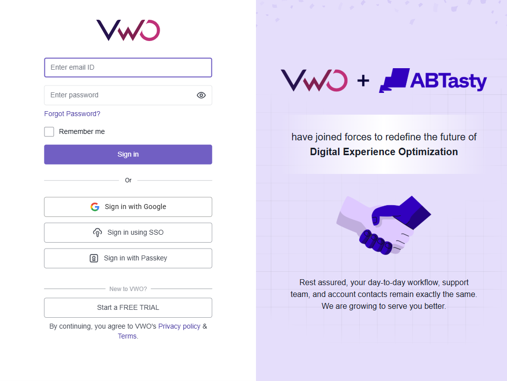

# End-to-End Automated Testing Flow: From Planning to Bug Creation

Here is the complete, step-by-step process we follow for our automated testing workflow. We start by planning out the tests, running the automation with Playwright, and finishing by automatically logging any issues directly into Jira.

## Step 1: Create the Test Plan
Before writing a single line of code, we define what needs to be tested. The test plan acts as our roadmap. It outlines our goals, the login features we are focusing on, the resources we need, and the overall testing strategy. 
*You can view our detailed plan here:* [VWO Login Test Plan](./demo/VWO_Login_Test_Plan.md)

## Step 2: Define the Test Cases
Next, we break down the Test Plan into specific, actionable test cases. For the login flow, we created multiple scenarios:
- **Positive Testing:** Logging in with a real, valid account.
- **Negative Testing:** Trying to log in with fake credentials, extremely long strings, Arabic/Chinese characters, and malicious database code (SQL injection).
*Check out our negative test scenarios here:* [Invalid Login Test Cases](./demo/VWO_Invalid_Login_Test_Cases.md)

## Step 3: Test Execution using Playwright
Once the cases are written, our Playwright automated scripts take over. During this step, the script:
1. Opens up the web browser and navigates to the login page.
2. Automatically fills in the email and password fields based on our defined Test Cases.
3. Clicks the "Sign In" button.
4. Verifies the results (e.g., confirming that invalid users receive a visible error message rather than accessing the dashboard).

## Step 4: Create a Custom HTML Report
When the execution is finished, Playwright generates a custom HTML results report. This interactive document provides a clean summary of our test run—highlighting exactly how many tests passed, failed, or were skipped, and providing deep insights into each test run. 
*View our generated execution report here:* [VWO Test Execution Report](./demo/VWO_Test_Execution_Report.html)

## Step 5: Integrating with Jira MCP to Create Bugs Automatically
If our automated execution catches a bug (for example, if an invalid password somehow logs the user in), we don't log the bug manually. 

Instead, we trigger the **Jira MCP (Model Context Protocol)** integration. Playwright communicates the exact test failure directly to Jira. It instantly creates a formatted Bug Ticket containing:
- The exact steps required to reproduce the error.
- The expected vs. actual results.
- Screenshots and console logs from the failed Playwright test.

This seamless pipeline ensures that our engineering team is immediately notified with all the details they need to fix the issue!
